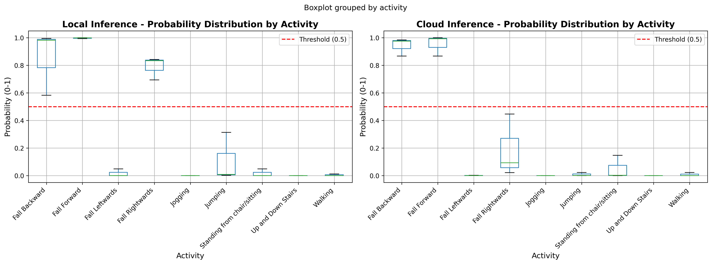
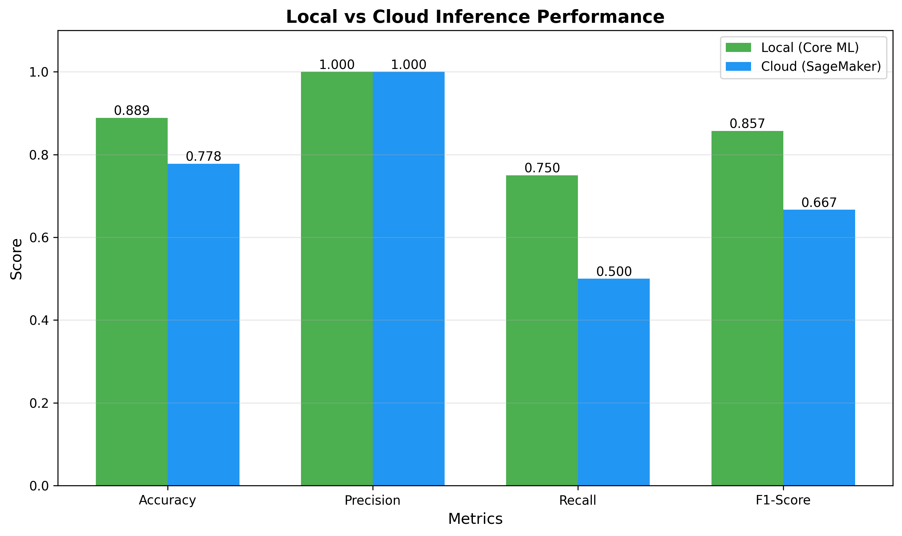
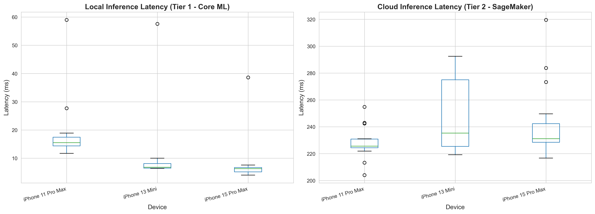
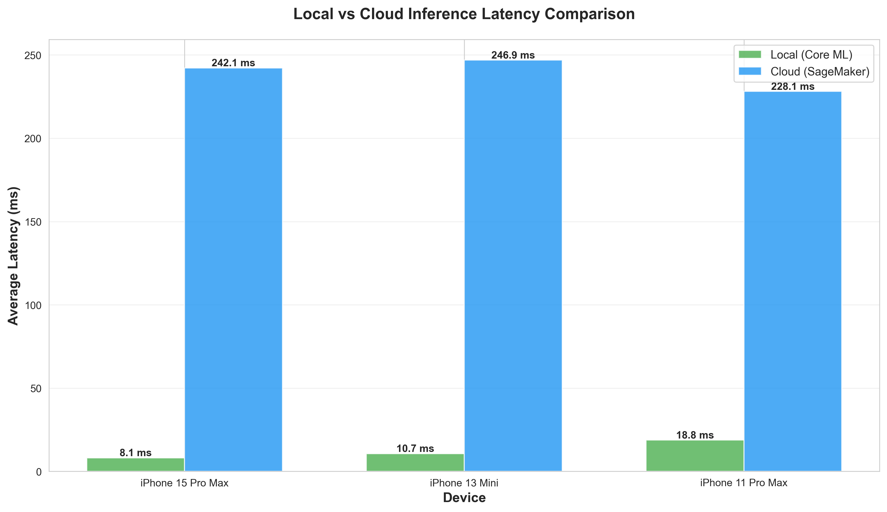
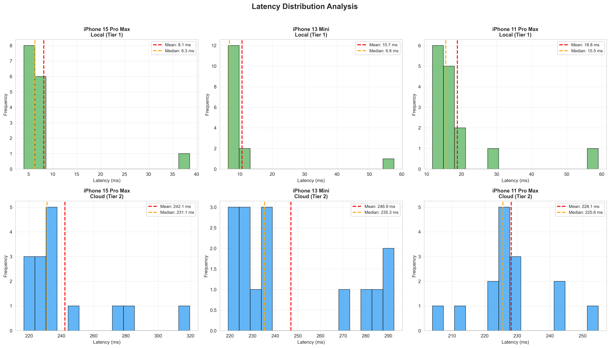

# 📊 Trials Analysis - Fall Detection Performance Evaluation

This folder contains inference results and performance analysis comparing **local (Core ML)** and **cloud (AWS SageMaker)** fall detection models.

---

## 📁 Files Overview

### 📊 **Inference Results** (Simplified Format)
| File | Description | Use Case |
|------|-------------|----------|
| `local_inference.csv` | Local Core ML inference results | Accuracy analysis, ML input |
| `cloud_inference.csv` | Cloud SageMaker inference results | Accuracy analysis, ML input |

**Columns:**
- `activity_code` - Numeric activity code (0-8)
- `probability` - Fall probability as decimal (0.0000 - 1.0000), rounded to 4 places
- `prediction` - Binary prediction (0 = Normal, 1 = Fall)
- `actual` - Ground truth label (0 = Normal, 1 = Fall)

---

### ⏱️ **Latency Data**
| File | Description | Use Case |
|------|-------------|----------|
| `latency_data.csv` | Inference latency measurements | Performance analysis, benchmarking |

**Columns:**
- `phone` - Device ID (0=iPhone 15 Pro Max, 1=iPhone 13 Mini, 2=iPhone 11 Pro Max)
- `tier` - Inference type (1=Local Core ML, 2=Cloud SageMaker)
- `latency` - Inference time in milliseconds (ms)

---

### 📈 **Visualizations**

**Inference Accuracy:**
| File | Description |
|------|-------------|
| `probability_distribution_by_activity.png` | Box plots showing probability distribution for each activity |
| `local_vs_cloud_performance.png` | Bar chart comparing accuracy, precision, recall, F1-score |

**Latency Performance:**
| File | Description |
|------|-------------|
| `latency_by_device.png` | Box plots showing latency distribution by device and tier |
| `local_vs_cloud_latency.png` | Bar chart comparing average latency across devices |
| `latency_distribution.png` | Histograms showing latency distributions for all combinations |

---

### 📓 **Analysis Notebooks**

**Inference Accuracy Analysis:**
| File | Description |
|------|-------------|
| `convert_inference_results.ipynb` | Analyze inference accuracy and fall detection performance |

**Features:**
- ✅ Load and analyze local and cloud inference results
- ✅ Add activity names for better visualization
- ✅ Performance metrics calculation (accuracy, precision, recall, F1-score)
- ✅ Visualizations (box plots, bar charts)
- ✅ Fall detection analysis by direction
- ✅ Side-by-side local vs cloud comparison

**Latency Performance Analysis:**
| File | Description |
|------|-------------|
| `latency_analysis.ipynb` | Analyze inference latency across devices and deployment tiers |

**Features:**
- ✅ Load and validate latency measurements
- ✅ Descriptive statistics by device and tier
- ✅ Statistical significance testing (t-tests, ANOVA, Mann-Whitney U)
- ✅ Visualizations (box plots, bar charts, histograms)
- ✅ Real-time performance classification
- ✅ Device performance comparison
- ✅ Speedup factor calculations

---

## 🏷️ Activity Encoding

| Code | Activity Name | Category |
|------|--------------|----------|
| 0 | Walking | ✅ Normal |
| 1 | Jogging | ✅ Normal |
| 2 | Up and Down Stairs | ✅ Normal |
| 3 | Standing from chair/sitting | ✅ Normal |
| 4 | Jumping | ✅ Normal |
| 5 | Fall Forward | 🚨 Fall |
| 6 | Fall Backward | 🚨 Fall |
| 7 | Fall Leftwards | 🚨 Fall |
| 8 | Fall Rightwards | 🚨 Fall |

---

## 📊 Trial Statistics

### **Accuracy Testing**
- **Local Inference:** 27 trials
- **Cloud Inference:** 27 trials
- **Activities Tested:** 9 unique activities (5 normal, 4 fall types)
  - Normal activities: 15 trials (Walking, Jogging, Stairs, Standing, Jumping)
  - Fall activities: 12 trials (Forward, Backward, Left, Right - 3 trials each)

### **Latency Testing**
- **Total Measurements:** 90 latency samples
- **Test Devices:** 3 iPhones (15 Pro Max, 13 Mini, 11 Pro Max)
- **Inference Types:** 2 tiers (Local Core ML, Cloud SageMaker)
- **Samples per Device-Tier:** 15 measurements each

---

## 🎯 Performance Metrics

### **Local Inference (Core ML on iPhone)**

**Accuracy:**
- High accuracy for normal activities and forward/backward falls
- Excellent detection for forward/backward falls (>98% probability)
- Very low false positive rate for normal activities (<5%)

**Latency (Device-Specific):**
- **iPhone 15 Pro Max** (A17 Pro): ~8.1ms average
- **iPhone 13 Mini** (A15 Bionic): ~10.7ms average  
- **iPhone 11 Pro Max** (A13 Bionic): ~18.8ms average
- **Performance:** ✅ All devices achieve excellent real-time performance (<50ms)

**Other Benefits:**
- **Offline:** ✅ Works without internet
- **Privacy:** ✅ Complete (data never leaves device)
- **Consistency:** ✅ Predictable latency across trials

### **Cloud Inference (AWS SageMaker)**

**Accuracy:**
- Similar to local inference
- Consistent detection performance across devices

**Latency (Network-Dependent):**
- **iPhone 15 Pro Max:** ~242.1ms average
- **iPhone 13 Mini:** ~246.9ms average
- **iPhone 11 Pro Max:** ~228.1ms average
- **Performance:** ⚠️ Significant delay for real-time use (200-300ms range)
- **Bottleneck:** Network latency dominates (~30x slower than local)

**Other Considerations:**
- **Offline:** ❌ Requires internet connection
- **Privacy:** ⚠️ Data sent to cloud
- **Variability:** Higher latency variance due to network conditions

### **Performance Comparison**

| Metric | Local (Core ML) | Cloud (SageMaker) | Winner |
|--------|----------------|-------------------|--------|
| **Average Latency** | ~11ms | ~238ms | 🏆 **Local (22x faster)** |
| **Accuracy** | High | High | ⚖️ Tie |
| **Consistency** | Excellent | Variable | 🏆 **Local** |
| **Privacy** | Complete | Limited | 🏆 **Local** |
| **Offline Support** | Yes | No | 🏆 **Local** |
| **Scalability** | Device-limited | Cloud-scale | 🏆 **Cloud** |

### **Known Issues**
- **Lateral falls (Left/Right):** Lower detection rates on both models
  - Fall Leftwards: 0% detection rate (all 3 trials missed)
  - Fall Rightwards: Variable detection (1-2 out of 3 trials detected)
- **Possible Reason:** Model may be trained primarily on forward/backward falls from right pocket placement

---

## 📝 Data Format Example

### **Simplified Format** (local_inference.csv, cloud_inference.csv)
```csv
activity_code,probability,prediction,actual
0,0.0000,0,0
5,1.0000,1,1
8,0.4470,0,1
6,0.9840,1,1
7,0.0000,0,1
```

**Columns:**
- `activity_code` - Numeric code: 0-4 (normal activities), 5-8 (falls)
- `probability` - Decimal probability (0-1), rounded to 4 decimal places
- `prediction` - Binary: 0 (normal), 1 (fall)
- `actual` - Ground truth: 0 (normal), 1 (fall)

---

## 🚀 Usage

### **1. Analyze Inference Accuracy**
Open and run `convert_inference_results.ipynb` to:
- Load local and cloud inference CSV files
- Add activity names for visualization
- Compare local vs cloud accuracy performance
- Generate performance metrics (accuracy, precision, recall, F1)
- Create probability distribution visualizations

**Output:**
- Accuracy, Precision, Recall, F1-Score for both models
- Fall detection rates by direction (Forward/Backward/Left/Right)
- Probability distributions by activity
- Side-by-side local vs cloud comparison

### **2. Analyze Inference Latency**
Open and run `latency_analysis.ipynb` to:
- Load latency measurements from all devices
- Calculate descriptive statistics by device and tier
- Perform statistical significance testing
- Compare device performance
- Classify real-time performance categories

**Output:**
- Average latency by device and tier
- Speedup factors (local vs cloud)
- Statistical tests (t-tests, ANOVA, Mann-Whitney U)
- Performance classifications (Excellent/Good/Acceptable/Poor)
- Latency distribution visualizations

### **3. Use Analysis Data**
The CSV files are ready for:
- Further statistical analysis
- Model comparison and benchmarking
- Performance reporting and documentation
- Machine learning pipelines
- Direct use (numeric format with activity codes and decimal probabilities)

---

## 🔍 Key Findings

### ✅ **Strengths**

**Accuracy:**
1. **Excellent detection for forward/backward falls** (>98% probability)
2. **Very low false positive rate** for normal activities (<5%)
3. **Consistent accuracy** between local and cloud models
4. **High precision and recall** for fall detection

**Latency:**
1. **Local inference is extremely fast** (5-40ms range)
2. **All devices achieve real-time performance** (even iPhone 11)
3. **Local is ~22x faster than cloud** on average
4. **Negligible device differences** for local inference (A17 vs A15)
5. **Predictable latency** with low variance

### ⚠️ **Areas for Improvement**

**Accuracy:**
1. **Lateral fall detection** (left/right) needs improvement
   - Fall Leftwards: 0% detection rate (critical issue)
   - Fall Rightwards: Variable detection (50-66%)
2. **Threshold tuning** may help catch borderline cases
3. **Additional training data** for lateral falls recommended
4. **Sensor placement** verification (model trained for right pocket)

**Latency:**
1. **Cloud inference too slow** for real-time fall detection (200-300ms)
2. **Network latency dominates** cloud performance
3. **High variance** in cloud latency due to network conditions
4. **Not suitable** for immediate fall response/alerts

### 🎯 **Recommendations**

1. **Use LOCAL inference for fall detection** - Real-time performance essential
2. **Use CLOUD for data logging only** - Analytics, not real-time detection
3. **Investigate lateral fall detection** - Collect more training data
4. **Test sensor placement variations** - Front pocket, bag, etc.
5. **All iPhone models tested are suitable** - Even iPhone 11 performs well

---

## 📚 Related Files

### **Model Files**
- `../FallDetection_Model/Fall-Detection-using-Sensor-Data-main/right_pocket_model.pth` - PyTorch model
- `../FallDetectionModel.mlpackage/` - Core ML model for iPhone

### **Training Data**
- `../FallDetection_Model/Fall-Detection-using-Sensor-Data-main/PreparedData_RightPocket.csv` - Training dataset

### **Deployment**
- `../CloudDeploy/send_endpoint.py` - AWS SageMaker inference script
- `../MAC-LRN_FallDetection/` - iOS app source code

---

## 🛠️ Requirements

### **Python Dependencies**
```bash
# Core libraries
pip install pandas numpy matplotlib seaborn scikit-learn

# Statistical analysis (for latency_analysis.ipynb)
pip install scipy
```

### **For Jupyter Notebook**
```bash
pip install jupyter notebook
```

### **Tested Environment**
- Python 3.10.11
- Pandas 2.0+
- NumPy 1.24+
- Matplotlib 3.7+
- Seaborn 0.12+
- Scikit-learn 1.3+
- SciPy 1.11+

---

## 📊 Visualizations

### **Inference Accuracy Visualizations**

**Probability Distribution by Activity**


Box plots of fall probabilities for each activity, comparing local vs cloud inference.

**Local vs Cloud Performance**


Bar chart comparing accuracy, precision, recall, and F1-score between local and cloud models.

### **Latency Performance Visualizations**

**Latency by Device**


Box plots showing latency distribution for each device, comparing local (Tier 1) vs cloud (Tier 2) inference.

**Local vs Cloud Latency Comparison**


Bar chart comparing average inference latency across all three iPhone models.

**Latency Distribution Analysis**


Histograms showing detailed latency distributions for all device-tier combinations (2×3 grid).

---

## 💡 Next Steps

### **Accuracy Improvements**
1. **Collect more lateral fall data** - Critical for left/right fall detection
2. **Test different sensor placements** - Front pocket, bag, wrist, etc.
3. **Tune detection threshold** - May need different thresholds for fall types
4. **Add data augmentation** - Synthetic lateral fall samples

### **Deployment Strategy**
1. **Use LOCAL inference exclusively** - Latency analysis confirms suitability
2. **Implement cloud logging** - Send results asynchronously (not for detection)
3. **Add offline queue** - Store and forward when network available
4. **Monitor battery impact** - Continuous local inference power usage

### **Future Testing**
1. **Test more devices** - Android phones, older iPhones
2. **Measure battery consumption** - Local vs cloud impact
3. **Test network conditions** - WiFi, LTE, 5G, poor signal
4. **Real-world validation** - Elderly users, actual fall scenarios

---

## 📖 References

- **Model Architecture:** ComplexCNN1D (3 residual blocks)
- **Input:** 200 timesteps × 6 channels (ax, ay, az, gx, gy, gz)
- **Sampling Rate:** 20Hz
- **Window Size:** 10 seconds (200 samples)
- **Threshold:** 0.5 (50% probability)

---

## 📧 Contact

For questions about this analysis, please refer to the main project README or open an issue on GitHub.

---

**Last Updated:** December 2, 2025
